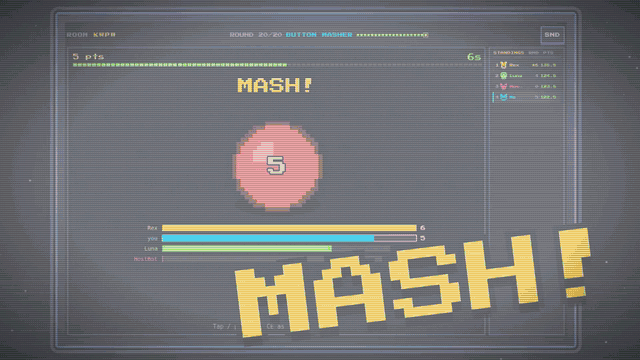

# Pixel Party

A browser-based multiplayer collection of mini-games, *Mario Party* style: players connect to a room
from their own device, play a series of short mini-games back to back, and accumulate points to form a
session-wide ranking.

<p align="center">
  <a href="docs/promo/pixel-party-promo-share.mp4">
    
  </a>
  <br>
  <sub>▶ <a href="docs/promo/pixel-party-promo-share.mp4">Watch the 42-second trailer</a> (with sound) ·
  made with HTML, see <a href="docs/promo/README.md"><code>docs/promo/</code></a></sub>
</p>

> Current status: **feature-complete for its LAN-party scope** — 54 mini-games (free-for-all, team and
> 1v1 duels), lobby + host setup, server-authoritative sessions with a cumulative ranking, post-match
> skill radar, catch-up handicap, reconnect, EN/ES, chiptune audio and a retro arcade look. See
> [Running locally](#running-locally) and [`docs/backlog.md`](docs/backlog.md).

## Documentation

| Document | Description |
|----------|-------------|
| [`docs/PRD.md`](docs/PRD.md) | Product Requirements Document: vision, goals, personas, flows, requirements, and scope. |
| [`docs/minigame-catalog.md`](docs/minigame-catalog.md) | Mini-game catalog with mechanics, rules, win condition, and scoring (grows over time). |
| [`docs/minigame-ideas.md`](docs/minigame-ideas.md) | ~30 mini-game ideas ranked by priority (fun, healthy competition, effort, latency). |
| [`docs/scoring-system.md`](docs/scoring-system.md) | Scoring across mini-games, session ranking, tiebreakers, and handicap. |
| [`docs/technical-architecture.md`](docs/technical-architecture.md) | Stack & architecture — mirrors the `utopia-offline` reference project. |
| [`docs/art-direction.md`](docs/art-direction.md) | Retro classic-arcade pixel-art visual identity (web, HUD, scoreboards). |
| [`docs/backlog.md`](docs/backlog.md) | Phased roadmap: minimal MVP first, then incremental epics. |
| [`docs/implementation-decisions.md`](docs/implementation-decisions.md) | Decision log: what was built/deferred and why. |
| [`docs/playtest-bugs.md`](docs/playtest-bugs.md) | Bugs found in LAN playtests and their status. |
| [`docs/promo/`](docs/promo/README.md) | ~42 s promo video (HTML timeline + MP4 renderer), cut to the game's soundtrack. |

## Concept in one line

Enter a room with a code, wait in the lobby for your group, play N short mini-games in a row, and crown
whoever accumulated the most points.

## Running locally

Requires [Bun](https://bun.sh) (1.3+). Install once from the repo root:

```bash
bun install
```

Start everything with one command:

```bash
bun run dev           # server (:3000) + Angular client (:4200) together; Ctrl-C stops both
```

Or run them separately in two terminals:

```bash
bun run dev:server    # game server on http://localhost:3000 (WS + /api)
bun run dev:client    # Angular dev server on http://localhost:4200 (proxies /api + /ws to :3000)
```

Then open `http://localhost:4200`:

1. Type a name and **Create room** — you become the host and land in the lobby.
2. Open the same URL in another tab/device, enter the room code, and **Join**.
3. The host picks the line-up (filter by skill axis, set the round count) and presses **Start**; each
   round opens with a how-to-play card and a countdown, then the mini-game, then the round result +
   standings, and finally the podium.

To play across devices on your LAN, serve the client with `--host` (`bun run --filter client start -- --host 0.0.0.0`)
and open the shown LAN URL.

### Checks

```bash
bun run lint            # Biome
bun run lint:determinism # domain purity gate (no Math.random / Date.now in domain/)
bun run typecheck       # tsc --noEmit across server, shared, client
bun run test            # server + shared (bun test)
bun run build:client    # production Angular build
```

### Claude Code skills

Repeatable project workflows live in [`.claude/skills/`](.claude/skills/): `verify-all` (the full
quality gate, incl. bootstrapping Bun), `playtest-screenshots` (bots + headless Chrome screenshot a
whole session on desktop/phone sizes), `minigame-scene` (build or polish a mini-game scene on the shared
scene base), `add-i18n-keys` (safe EN + ES translation edits) and `promo-video` (update/re-render the
promo video).

## Tech

**Bun** monorepo · **TypeScript** · **hexagonal** server · **Bun-native WebSockets** · **Angular 20 +
Phaser 3** client · **no database** (stateless, anonymous, by design) · **Biome**. Server-authoritative
and deterministic, mirroring the `utopia-offline` reference project. See
[`docs/technical-architecture.md`](docs/technical-architecture.md).
